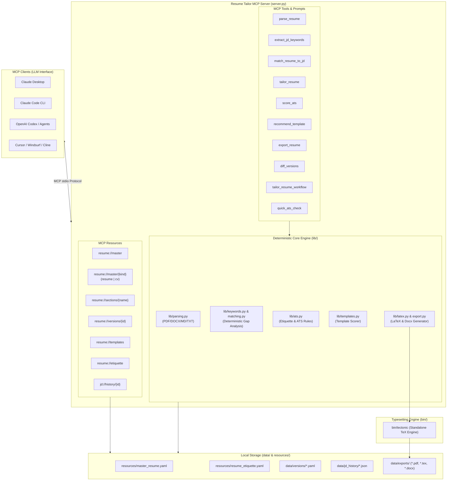

# Resume Tailor MCP Server 🚀

[](https://opensource.org/licenses/MIT)
[](https://modelcontextprotocol.io)
[](https://www.python.org)
[](#privacy--zero-api-keys)
[](https://tectonic-typesetting.github.io/)

An open-source, local-first **Model Context Protocol (MCP)** server that tailors your resume to any job description. It extracts Job Description (JD) keywords, performs deterministic gap and ATS compliance analysis, manages versioned resume states, and compiles publication-quality PDFs (with LaTeX source) directly inside your AI chat context—with **zero external API keys or recurring subscription fees**.

---

## 📑 Table of Contents

- [What It Does](#-what-it-does)
- [How It Works](#-how-it-works)
- [Architecture](#-architecture)
- [Installation & Quick Start](#-installation--quick-start)
  - [Prerequisites](#prerequisites)
  - [1. Install Python Dependencies](#1-install-python-dependencies)
  - [2. Download the Tectonic LaTeX Engine](#2-download-the-tectonic-latex-engine)
  - [3. Add Your Master Resume](#3-add-your-master-resume)
- [Client Integration Guides](#-client-integration-guides)
  - [Claude Desktop](#1-claude-desktop)
  - [Claude Code (CLI)](#2-claude-code-cli)
  - [OpenAI Codex & Custom MCP Clients](#3-openai-codex--custom-mcp-clients)
  - [Cursor / Windsurf / Cline / VS Code IDEs](#4-cursor--windsurf--cline--vs-code-ides)
- [How to Use This Repository (Step-by-Step Guide)](#-how-to-use-this-repository-step-by-step-guide)
  - [Repository Layout & Where Files Live](#repository-layout--where-files-live)
  - [Core Workflows & Example Prompts](#core-workflows--example-prompts)
  - [Developer & Standalone Python Usage](#developer--standalone-python-usage)
- [How to Achieve Maximum Value (Power User Guide)](#-how-to-achieve-maximum-value)
  - [The 5-Step Optimal Tailoring Cycle](#the-5-step-optimal-tailoring-cycle)
  - [The "Proof vs. Mention" Rule](#the-proof-vs-mention-rule)
  - [The Harvard/Ivy Action Verb Formula](#the-harvardivy-action-verb-bullet-formula)
  - [The No-Fabrication Golden Rule](#the-no-fabrication-golden-rule)
  - [Diffing & Version Management](#diffing--version-management)
- [MCP Surface Reference](#-mcp-surface-reference)
  - [Resources](#resources-uri-addressable)
  - [Tools](#tools-deterministic-actions)
  - [Prompts](#prompts-guided-workflows)
- [Resume Layout Templates](#-resume-layout-templates)
- [Troubleshooting](#-troubleshooting)
- [Contributing & Community](#-contributing--community)
- [License](#-license)

---

## 💡 What It Does

`resume-tailor-mcp` connects your favorite AI agent (Claude Desktop, Claude Code, Codex, Cursor, Windsurf) to a local resume optimization engine:

1. **Deterministic JD Keyword Extraction**: Automatically scans job postings for required skills, frameworks, tools, seniority level, and years of experience without hallucinations.
2. **Gap Analysis & Proof Matching**: Categorizes keywords into:
   - **Matched**: Validated with quantifiable proof in your experience or project bullets.
   - **Weak**: Listed in your skills section but absent from your actual project/work achievements.
   - **Missing**: Completely absent from your current resume.
3. **Automated ATS & Etiquette Auditing**: Scrutinizes resume structure against Ivy League career-center guidelines (action verbs, quantifiable metrics, bullet length, eliminating cliches like *"responsible for"* or *"team player"*, and stripping risky personal identifiers).
4. **Intelligent Layout Recommendation**: Scores and selects the optimal resume template based on the JD's seniority and domain requirements.
5. **Direct In-Chat PDF & LaTeX Delivery**: Compiles the popular "Jake's Resume" LaTeX format via a bundled offline TeX engine (`tectonic`), streaming both the raw `.tex` source and binary `.pdf` straight into the conversation window.
6. **Local-First & Private**: Your resume and job history remain stored locally on your machine in human-readable YAML.

---

## ⚙️ How It Works

When connected via the Model Context Protocol over `stdio`, the server acts as an intelligent intermediary between your local filesystem and the AI LLM:

1. **State Exposure via URIs**: The server exposes your canonical master resume (`resume://master`), saved variations (`resume://versions/{id}`), templates (`resume://templates`), and career writing rules (`resume://etiquette`) as browsable MCP resources.
2. **Deterministic Tool Pipeline**: Instead of letting an LLM guess your ATS compatibility, the server uses deterministic Python algorithms (`lib/matching.py`, `lib/keywords.py`, `lib/ats.py`) to compute reproducible scores and concrete keyword deltas.
3. **Contextual In-Chat Rewrite**: The LLM uses the gap analysis and writing rules to rewrite relevant bullets—preserving factual accuracy while maximizing JD alignment.
4. **Instant Compilation & Delivery**: Once validated, the server compiles the updated resume using `tectonic` into an ATS-friendly, single/two-page PDF and provides the downloadable artifact directly inside the chat.

---

## 🏗️ Architecture



### Subsystem Breakdown

| Module | Location | Purpose |
| :--- | :--- | :--- |
| **Server Controller** | `server.py` | FastMCP entrypoint exposing resources, tools, and guided prompts. |
| **Parsing Pipeline** | `lib/parsing.py` | Multi-format parser supporting Markdown, `.docx`, `.pdf`, and `.txt` into structured YAML. |
| **Keyword & Matching Engine** | `lib/keywords.py`, `lib/matching.py` | Deterministic token extraction, seniority parsing, and 3-way proof matching. |
| **ATS & Etiquette Validator** | `lib/ats.py` | Structural validation enforcing Ivy-League bullet conventions, character counts, and eliminating buzzwords. |
| **Template Scorer** | `lib/templates.py` | Scored matrix matching candidate profile and JD demands to 5 specialized layouts. |
| **Typesetting & Exporter** | `lib/latex.py`, `lib/export.py` | Renders clean LaTeX code and invokes `bin/tectonic` to produce high-res PDFs and DOCX files. |

---

## 🚀 Installation & Quick Start

### Prerequisites

- **Python 3.10+**
- macOS, Linux, or Windows (WSL / Native)

### 1. Install Python Dependencies

Clone the repository and install the required dependencies:

```bash
git clone https://github.com/priyanshu-arya/Resume-Tailor-MCP.git
cd Resume-Tailor-MCP

# Recommended: Create a virtual environment
python3 -m venv .venv
source .venv/bin/activate  # On Windows: .venv\Scripts\activate

# Install requirements
pip install -r requirements.txt
```

### 2. Download the Tectonic LaTeX Engine

PDF export uses **Tectonic**, a self-contained LaTeX engine that requires **no system TeX Live or MacTeX installation**:

```bash
# macOS (Apple Silicon - M1/M2/M3/M4):
curl -L -o /tmp/tectonic.tar.gz "https://github.com/tectonic-typesetting/tectonic/releases/download/tectonic%400.17.0/tectonic-0.17.0-aarch64-apple-darwin.tar.gz"
mkdir -p bin && tar -xzf /tmp/tectonic.tar.gz -C bin && chmod +x bin/tectonic

# macOS (Intel x86_64):
curl -L -o /tmp/tectonic.tar.gz "https://github.com/tectonic-typesetting/tectonic/releases/download/tectonic%400.17.0/tectonic-0.17.0-x86_64-apple-darwin.tar.gz"
mkdir -p bin && tar -xzf /tmp/tectonic.tar.gz -C bin && chmod +x bin/tectonic

# Linux (x86_64):
curl -L -o /tmp/tectonic.tar.gz "https://github.com/tectonic-typesetting/tectonic/releases/download/tectonic%400.17.0/tectonic-0.17.0-x86_64-unknown-linux-musl.tar.gz"
mkdir -p bin && tar -xzf /tmp/tectonic.tar.gz -C bin && chmod +x bin/tectonic
```

> **Note on First PDF Run:** The first time you export a PDF, Tectonic will download and cache the necessary LaTeX packages (requires internet access once). Subsequent compilations run completely offline in milliseconds.

### 3. Add Your Master Resume

You have two options:
1. **Automated Import**: Place your existing `.pdf`, `.docx`, or `.md` resume/CV on your machine and ask your AI assistant to run `parse_resume(file_path="/path/to/resume.pdf")`. Pass `kind="cv"` instead of the default `kind="resume"` if you're importing an academic/research CV -- resume and CV are kept as two separate master documents, never merged.
2. **Direct YAML Editing**: Edit `resources/master_resume.yaml` (or `resources/master_cv.yaml`) directly using any text editor.

---

## 🔌 Client Integration Guides

### 1. Claude Desktop

1. Open **Claude Desktop**.
2. Navigate to **Settings** -> **Developer** -> **Edit Config** to open `claude_desktop_config.json`:
   - **macOS**: `~/Library/Application Support/Claude/claude_desktop_config.json`
   - **Windows**: `%APPDATA%\Claude\claude_desktop_config.json`
3. Add `resume-tailor` to the `mcpServers` block (use the absolute path to your repo and virtualenv python):

```json
{
  "mcpServers": {
    "resume-tailor": {
      "command": "/absolute/path/to/resume-tailor-mcp/.venv/bin/python",
      "args": [
        "/absolute/path/to/resume-tailor-mcp/server.py"
      ]
    }
  }
}
```

4. Completely restart Claude Desktop (**Cmd+Q** on macOS or exit from system tray on Windows).
5. Open a new chat. You will see the 🔌 icon with `resume-tailor` tools and resources active!

---

### 2. Claude Code (CLI)

Add `resume-tailor` directly to your Claude Code environment using the `claude mcp add` command:

```bash
# Add the server using your virtualenv Python interpreter
claude mcp add resume-tailor -- /absolute/path/to/resume-tailor-mcp/.venv/bin/python /absolute/path/to/resume-tailor-mcp/server.py
```

Alternatively, add it to your project-level `.mcp.json` or global Claude Code settings:

```json
{
  "mcpServers": {
    "resume-tailor": {
      "command": "/absolute/path/to/resume-tailor-mcp/.venv/bin/python",
      "args": ["/absolute/path/to/resume-tailor-mcp/server.py"]
    }
  }
}
```

**Using it in Claude Code:**
```bash
claude "Tailor my master resume to the job description in job_posting.txt and export as a PDF."
```

---

### 3. OpenAI Codex & Custom MCP Clients

For OpenAI Codex CLI, custom agents, or Python MCP host runners, start the server as a subprocess via standard input/output (`stdio`):

```python
from mcp import ClientSession, StdioServerParameters
from mcp.client.stdio import stdio_client

server_params = StdioServerParameters(
    command="/absolute/path/to/resume-tailor-mcp/.venv/bin/python",
    args=["/absolute/path/to/resume-tailor-mcp/server.py"],
    env=None
)

async with stdio_client(server_params) as (read, write):
    async with ClientSession(read, write) as session:
        await session.initialize()
        # Call deterministic matching or gap analysis
        match_result = await session.call_tool(
            "match_resume_to_jd",
            arguments={"jd_text": "Looking for a Senior Python / FastAPI engineer with AWS experience."}
        )
        print(match_result)
```

---

### 4. Cursor / Windsurf / Cline / VS Code IDEs

To enable `resume-tailor` in modern AI-integrated IDEs:

#### Cursor (`~/.cursor/mcp.json` or `.cursor/mcp.json`)
```json
{
  "mcpServers": {
    "resume-tailor": {
      "command": "/absolute/path/to/resume-tailor-mcp/.venv/bin/python",
      "args": ["/absolute/path/to/resume-tailor-mcp/server.py"]
    }
  }
}
```

#### Windsurf (`~/.codeium/windsurf/mcp_config.json`)
```json
{
  "mcpServers": {
    "resume-tailor": {
      "command": "/absolute/path/to/resume-tailor-mcp/.venv/bin/python",
      "args": ["/absolute/path/to/resume-tailor-mcp/server.py"]
    }
  }
}
```

#### Cline (VS Code Extension)
Open **Cline Settings** -> **MCP Servers** -> Edit `cline_mcp_settings.json` and paste the `resume-tailor` definition above.

---

## 💻 How to Use This Repository (Step-by-Step Guide)

### Repository Layout & Where Files Live

```
resume-tailor-mcp/
├── server.py                   # Main MCP server (FastMCP entrypoint)
├── requirements.txt            # Python dependencies (mcp, pyyaml, python-docx, pdfplumber)
├── bin/
│   └── tectonic                # Bundled standalone TeX compiler (downloaded once)
├── resources/
│   ├── master_resume.yaml      # 🌟 YOUR CANONICAL RESUME (edit or parse into this)
│   ├── master_cv.yaml          # 🌟 YOUR CANONICAL CV -- separate document, kind="cv"
│   ├── resume_etiquette.yaml   # Ivy League / ATS formatting rules & quality gates
│   └── templates/              # Layout definitions (Classic Minimalist, etc.)
├── data/
│   ├── versions/               # Saved tailored resume versions (*.yaml)
│   ├── jd_history/             # Saved job descriptions & keyword caches
│   └── exports/                # Generated PDFs, LaTeX (.tex), and Word (.docx) files
└── lib/                        # Deterministic scoring, parsing, matching, and LaTeX modules
```

---

### Core Workflows & Example Prompts

Once `resume-tailor` is connected to your MCP client (Claude Desktop, Claude Code, Cursor, Windsurf, or Codex), you interact with it using natural language. Here are the core user flows:

#### Workflow 1: Import Your Existing Resume
If you have an existing resume in `.pdf`, `.docx`, `.md`, or `.txt`:
> **You prompt:** *"Please import my resume from `/path/to/my_resume.pdf` as my master resume."*
>
> **What happens:** The server executes `parse_resume`, extracts your contact details, summary, experience bullets, education, skills, and projects, and writes the structured data to `resources/master_resume.yaml`.

---

#### Workflow 2: Tailor Resume to a Job Posting (Full End-to-End Flow)
When you have a target job posting and want a tailored, compiled PDF:
> **You prompt:**  
> *"Tailor my master resume to this Job Description for the Staff Software Engineer role at Stripe. Extract keywords, score the gap, rewrite the bullets honestly, run an ATS check, and export the final PDF:*
> 
> *[Paste Job Description Here]"*
>
> **What happens step-by-step:**
> 1. The agent reads `resume://etiquette` for bullet rewriting and ATS rules.
> 2. The agent runs `match_resume_to_jd` to identify **Missing** and **Weak** keywords.
> 3. The agent retrieves `get_master_resume` and rewrites bullet points to highlight your relevant experience using the Google XYZ formula.
> 4. The agent calls `tailor_resume(save_as="stripe-staff-eng-2026", ...)` to persist the new version.
> 5. The agent runs `score_ats` to confirm zero formatting or etiquette violations.
> 6. The agent calls `export_resume` with `format="pdf"`. Tectonic compiles the LaTeX template and returns **both the binary PDF directly in chat and the LaTeX source code**.

---

#### Workflow 3: Quick ATS & Keyword Gap Check (Audit Only)
If you just want to see how well your master resume matches a JD before making changes:
> **You prompt:**  
> *"Perform a quick ATS and keyword gap analysis of my master resume against this job posting without modifying anything yet:*
> 
> *[Paste Job Description Here]"*
>
> **What happens:** The server executes `match_resume_to_jd` and `score_ats`, returning your keyword match percentage, missing must-haves, weak skills, and structural ATS checklist.

---

#### Workflow 4: Review Diffs Between Tailored Versions
To see exactly what changed between your original master resume and a tailored version:
> **You prompt:** *"Show me the diff between my 'master' resume and the 'stripe-staff-eng-2026' version."*
>
> **What happens:** The server runs `diff_versions(version_a="master", version_b="stripe-staff-eng-2026")` and outputs a color-coded unified diff showing line-by-line bullet changes.

---

#### Workflow 5: Export to Other Formats (DOCX, Markdown, TeX)
To export an existing tailored version to Microsoft Word or plain Markdown:
> **You prompt:** *"Export version 'stripe-staff-eng-2026' as a docx file."*
>
> **What happens:** The server generates the Word document and saves it under `data/exports/stripe-staff-eng-2026.docx`.

---

### Developer & Standalone Python Usage

You can also run, test, and develop with this repository directly without an LLM:

#### 1. Test Server with MCP Inspector
Inspect and interactively test all tools and resources in your browser:
```bash
npx @modelcontextprotocol/inspector .venv/bin/python server.py
```

#### 2. Run Direct Python Scripts
You can import the core libraries directly in Python scripts:

```python
from lib import storage, matching, ats, export

# 1. Load your master resume
resume = storage.load_master()
print(f"Loaded resume for: {resume.get('name')}")

# 2. Score ATS compliance
ats_report = ats.score_ats(resume)
print(f"ATS Score: {ats_report['score']}/{ats_report['max_score']}")
if ats_report['issues']:
    print("Issues found:", ats_report['issues'])

# 3. Match against a sample job description
sample_jd = """
We are looking for a Senior Backend Engineer proficient in Python, FastAPI,
PostgreSQL, Docker, Kubernetes, and AWS to lead our microservices architecture.
"""
gap_analysis = matching.match_resume_to_jd(resume, sample_jd)
print(f"Keyword Score: {gap_analysis['score']}%")
print(f"Matched: {gap_analysis['matched']}")
print(f"Missing: {gap_analysis['missing']}")
print(f"Weak (skills only): {gap_analysis['weak']}")

# 4. Compile directly to PDF using Tectonic
pdf_path = export.to_pdf(resume, "data/exports/manual_build.pdf", "classic-minimalist")
print(f"Compiled PDF to: {pdf_path}")
```

---

## 🌟 How to Achieve Maximum Value

### The 5-Step Optimal Tailoring Cycle

```
 ┌──────────────────────┐
 │  1. Ingest Master    │ ─── Import your complete career history
 └──────────┬───────────┘
            ▼
 ┌──────────────────────┐
 │  2. Analyze JD Gap   │ ─── Identify Missing & Weak keywords
 └──────────┬───────────┘
            ▼
 ┌──────────────────────┐
 │  3. Guided Rewrite   │ ─── Apply Action Verbs + Google XYZ formula
 └──────────┬───────────┘
            ▼
 ┌──────────────────────┐
 │  4. ATS Audit        │ ─── Verify character density & formatting
 └──────────┬───────────┘
            ▼
 ┌──────────────────────┐
 │  5. LaTeX Compile    │ ─── Export publication-ready PDF + .tex
 └──────────────────────┘
```

1. **Maintain a Rich Master Resume (`resume://master`)**: Store every project, tool, accomplishment, and metric you've ever achieved in your master resume. The more raw material available, the more effectively the agent can pull authentic evidence.
2. **Execute the Workflow Prompt**: Use the built-in `tailor_resume_workflow` prompt:
   > *"Tailor my resume for the Senior Software Engineer position at Stripe using this job description..."*
3. **Target 85%+ Proof Match**: Move critical keywords from "Missing" or "Weak" into "Matched" by rephrasing past accomplishments to highlight the tools requested by the employer.
4. **Run `score_ats` Quality Check**: Ensure zero weak openers (*"helped with"*, *"worked on"*) and verify bullets are under 220 characters.
5. **Receive Direct PDF Artifact**: The server compiles and presents the `.pdf` and `.tex` source directly inside the chat window.

---

### The "Proof vs. Mention" Rule

Many ATS scanners and technical recruiters dismiss keywords that only appear in a skills list without supporting context:

- ❌ **Weak (Skills-Only)**: Listing `Kubernetes` in your Skills section without mentioning it anywhere in your job bullet points.
- ✅ **Matched (Proven)**: *"Architected and deployed multi-region **Kubernetes** clusters on AWS EKS, reducing deployment latency by 45%."*

`resume-tailor-mcp` automatically detects this distinction and provides both an `ats_visible_score` and a real `score` (proof-backed).

---

### The Harvard/Ivy Action Verb Bullet Formula

Every bullet point should follow the proven **Google XYZ** / **Harvard Career Service** model:

$$\text{Accomplished } [X] \text{ as measured by } [Y] \text{ by doing } [Z]$$

- **Weak**: *"Responsible for improving web application performance."*
- **Strong**: *"Engineered full-stack Redis caching layer and optimized SQL query plans, cutting p99 API response latency by 35% across 2M daily active users."*

---

### The No-Fabrication Golden Rule

As codified in `resume://etiquette`:
> **Never fabricate metrics, certifications, titles, or technical competencies.** Tailoring is about surfacing the *most relevant authentic truth*, re-ordering sections for impact, and aligning your genuine terminology with the employer's vocabulary.

---

### Diffing & Version Management

Keep tailored resumes organized per company and date. You can review the exact unified diff at any time:

```bash
# In chat: "Show diff between master and stripe-senior-swe"
# Calls diff_versions(version_a="master", version_b="stripe-senior-swe")
```

---

## 📚 MCP Surface Reference

### Resources (URI-Addressable)

| URI | Description | Output Format |
| :--- | :--- | :--- |
| `resume://master` | Canonical master resume. | YAML |
| `resume://master/{kind}` | Canonical master document by kind (`resume` or `cv`). | YAML |
| `resume://sections/{name}` | Individual section (`summary`, `skills`, `experience`, `education`, `projects`, `certifications`, `contact`) of the master resume. | YAML |
| `resume://versions/{version_id}` | Previously saved tailored resume version. | YAML |
| `resume://templates` | List of all available layout templates and matching notes. | YAML |
| `resume://templates/{template_id}` | Detailed metadata and configuration for a specific template. | YAML |
| `resume://etiquette` | Standard resume rules, bullet formulas, and quality gates. | Markdown/YAML |
| `jd://history/{jd_id}` | Saved job description and extracted keywords. | YAML |

---

### Tools (Deterministic Actions)

| Tool Name | Parameters | Description |
| :--- | :--- | :--- |
| `parse_resume` | `file_path: str`, `kind: str = "resume"` | Parses a `.pdf`, `.docx`, `.md`, or `.txt` file into the structured master schema and saves it as the master resume (`kind="resume"`) or master CV (`kind="cv"`) -- two separate canonical documents. |
| `get_master_resume` | `kind: str = "resume"` | Retrieves the complete master resume or master CV dictionary for editing. |
| `extract_jd_keywords` | `jd_text: str`, `save_as: str?` | Deterministically extracts must-have/nice-to-have keywords, seniority, and years of experience. |
| `match_resume_to_jd` | `jd_text: str`, `version: str = "master"` | Computes keyword gap analysis (`matched`, `missing`, `weak`) and score. |
| `tailor_resume` | `save_as: str`, `resume: dict`, `jd_text: str?`, `source_version: str = "master"` | Validates and saves a new tailored resume version. |
| `diff_versions` | `version_a: str`, `version_b: str` | Computes a unified diff between two saved resume versions. |
| `score_ats` | `version: str = "master"` | Audits structural ATS compliance, formatting, bullet length, and etiquette rules. |
| `list_templates` | *None* | Lists all available resume layout templates. |
| `recommend_template` | `jd_text: str`, `version: str = "master"` | Scores each layout template against JD requirements to pick the best match. |
| `export_resume` | `version: str`, `format: str = "pdf"`, `out_path: str?`, `template: str = "auto"`, `jd_text: str?` | Compiles and returns binary PDF + LaTeX source directly in the chat, or exports DOCX/MD/TXT. |
| `list_versions` | *None* | Returns a list of all saved tailored resume version IDs. |
| `list_saved_jds` | *None* | Returns a list of all saved job description IDs. |

---

### Prompts (Guided Workflows)

- **`tailor_resume_workflow(jd_text, company, role)`**: Complete multi-step agent flow that reads etiquette rules, performs keyword matching, executes truthful bullet rewrites, audits ATS scoring, and compiles the final PDF.
- **`quick_ats_check(jd_text, version)`**: Instant diagnostic that scores keyword coverage and checks ATS formatting without altering any resume text.

---

## 🎨 Resume Layout Templates

| Template ID | Name | Best Suited For | LaTeX/PDF Output |
| :--- | :--- | :--- | :---: |
| `classic-minimalist` | Classic Minimalist ("Jake's Resume") | Software Engineers, Data Scientists, General Tech Roles. Maximizes information density and ATS parse rate. | **Yes** (Bundled TeX) |
| `full-stack-modern` | Full-Stack Modern | Full-Stack/Web Developers with notable certifications and dense technical skills. | DOCX / MD / TXT |
| `student-achievements` | Student / Early Career | Internships, New Grads, coursework, and competitive programming achievements. | DOCX / MD / TXT |
| `generic-minimal` | Generic Minimal | Safe, clean, content-agnostic fallback for non-technical or hybrid roles. | DOCX / MD / TXT |
| `metrics-driven` | Metrics Driven | Senior, Staff, Lead, and Product Engineering roles highlighting scale and business impact. | DOCX / MD / TXT |

---

## 🛠️ Troubleshooting

<details>
<summary><b>1. Server does not appear in Claude Desktop</b></summary>

- Verify that `claude_desktop_config.json` contains valid JSON (ensure no trailing commas).
- Verify the Python executable path points to your virtualenv (`.venv/bin/python`).
- Fully restart Claude Desktop (use `Cmd+Q` on macOS or kill the process from Task Manager).
</details>

<details>
<summary><b>2. "No tectonic binary found" during PDF export</b></summary>

- Check that the executable exists at `bin/tectonic` and has execute permissions (`chmod +x bin/tectonic`).
- Run `./bin/tectonic --version` from the repository root to verify compatibility.
</details>

<details>
<summary><b>3. First PDF export takes a few seconds or fails offline</b></summary>

- Tectonic downloads minimal LaTeX packages on its very first run. Ensure you have internet access for the initial compile. Subsequent compiles are instantaneous and 100% offline.
</details>

<details>
<summary><b>4. ModuleNotFoundError when starting server</b></summary>

- Run `python3 server.py` directly from your terminal inside the virtual environment to identify any missing packages:
  ```bash
  source .venv/bin/activate
  pip install -r requirements.txt
  ```
</details>

---

## 🤝 Contributing & Community

Contributions are welcome! Whether you are adding a new LaTeX resume template, improving keyword extraction heuristics, or adding support for additional MCP clients:

1. **Fork the Repository**
2. **Create a Feature Branch** (`git checkout -b feature/amazing-template`)
3. **Commit Your Changes** (`git commit -m "Add modern sidebar LaTeX template"`)
4. **Push to the Branch** (`git push origin feature/amazing-template`)
5. **Open a Pull Request**

### Areas for Contribution
- [ ] Additional LaTeX templates (e.g., Deedy Resume, Modern CV).
- [ ] Multilingual keyword matching and JD parsing.
- [ ] Integration plugins for additional developer IDEs and agents.

---

## 📄 License

This project is licensed under the **MIT License** - see the [LICENSE](LICENSE) file for details.

```text
MIT License

Copyright (c) 2026 Priyanshu Arya

Permission is hereby granted, free of charge, to any person obtaining a copy
of this software and associated documentation files (the "Software"), to deal
in the Software without restriction, including without limitation the rights
to use, copy, modify, merge, publish, distribute, sublicense, and/or sell
copies of the Software, and to permit persons to whom the Software is
furnished to do so, subject to the following conditions:
...
```

---

<div align="center">
  <sub>Built with ❤️ using the <a href="https://modelcontextprotocol.io">Model Context Protocol</a> and <a href="https://tectonic-typesetting.github.io/">Tectonic Typesetting</a>.</sub>
</div>
